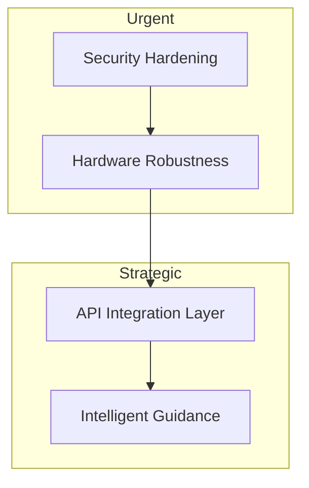

# Architectural Deep Dive & Issue Analysis: Orascan

This document provides a detailed technical audit of the Orascan system, focusing on its multi-component architecture, hardware-software boundary, and data integrity.

## 🏛️ Comprehensive Architecture

The system operates across three distinct domains:
1.  **Cloud/Central Management (`OraScan_backend`)**: A Go-based REST API designed for long-term data persistence and cross-device synchronization.
2.  **Edge Execution (`OraScan_Automated_Scanning`)**: A Python-based rich client that handles high-bandwidth sensor data and precise mechanical control.
3.  **Local Intelligence (`OraScan-Facemesh`)**: MediaPipe-powered computer vision logic for real-time patient guidance.

---

## 🚩 Critical Issues & Vulnerabilities

### 1. Database Security (SQL Injection)
- **Problem**: `database_utils.py` uses string formatting and unchecked parameters in several places, and the backend also has potential for improvement in parameterized queries.
- **Impact**: Malicious input could compromise the local MySQL database or the remote Postgres data.
- **Example**: `fetch_user_details` in `database_utils.py` passes `email` directly into the query execution.

### 2. Hardware Synchronization Risks
- **Problem**: The mechanical control (`motor_driver.py`) and UI updates are coupled through `asyncio.run_in_executor`. If a hardware step hangs or the camera fails to initialize, the UI state (`is_scanning`) might become permanently locked.
- **Impact**: System becomes unresponsive, requiring a hard reboot of the application.

### 3. Data Consistency & Sync Gaps
- **Problem**: There is a clear "split brain" between the Go backend (Azure/Postgres) and the Python apps (Local MySQL). Images are saved locally to `/captured_images` but there's no robust pipeline to sync these to the Azure cloud automatically.
- **Impact**: Patient data collected at the edge is not immediately available for remote diagnostic review.

### 4. Authentication Weaknesses
- **Problem**: The `OraScan_backend/api.go` uses a hardcoded JWT secret (`super-secret-key`).
- **Impact**: Any attacker with knowledge of the code can forge authentication tokens and access all patient records.

---

## 🚀 Recommended Improvements

### Phase 1: Critical Fixes (Security & Stability)
- **[CRITICAL]** **Parameterized Queries**: Refactor all SQL interactions in `database_utils.py` to use multi-argument `cursor.execute()` calls to prevent SQL injection.
- **[CRITICAL]** **Hardware Timeouts**: Implement a watchdog or timeout wrapper around `perform_capture_step` to prevent UI lockups on hardware failure.
- **[SECURITY]** **Environment Variables**: Move the JWT secret and database connection strings to a `.env` file for the Go backend (partially implemented, needs full enforcement).

### Phase 2: Structural Modernization
- **Unified API Client**: Create a shared Python module that wraps the Go backend API. The edge apps should use this client for authentication and image uploading, deprecating direct MySQL access for patient data.
-  **State Engine**: Implement a proper state machine for the scanning process to handle "Pause", "Resume", and "Retry Step" scenarios, which are currently missing.

### Phase 3: Intelligent Guidance Integration
- **Real-time Feedback**: Integrate the `Facemesh` logic (smile/mouth detection) into the `OralPhotoAcquisitionPage` component.
- **User Hook**: Show a "Mouth not open enough" warning in the UI before triggering the camera, significantly reducing the need for re-scans.

---

## 🛠️ Implementation Roadmap

## Summary of Potential Implementation Risks
- **Backward Compatibility**: Changing the local database schema might break existing scan history if not handled via a migration script.
- **Hardware Latency**: Adding CV-based guidance (`Facemesh`) during the scan loop might increase the total scan time if not optimized.
